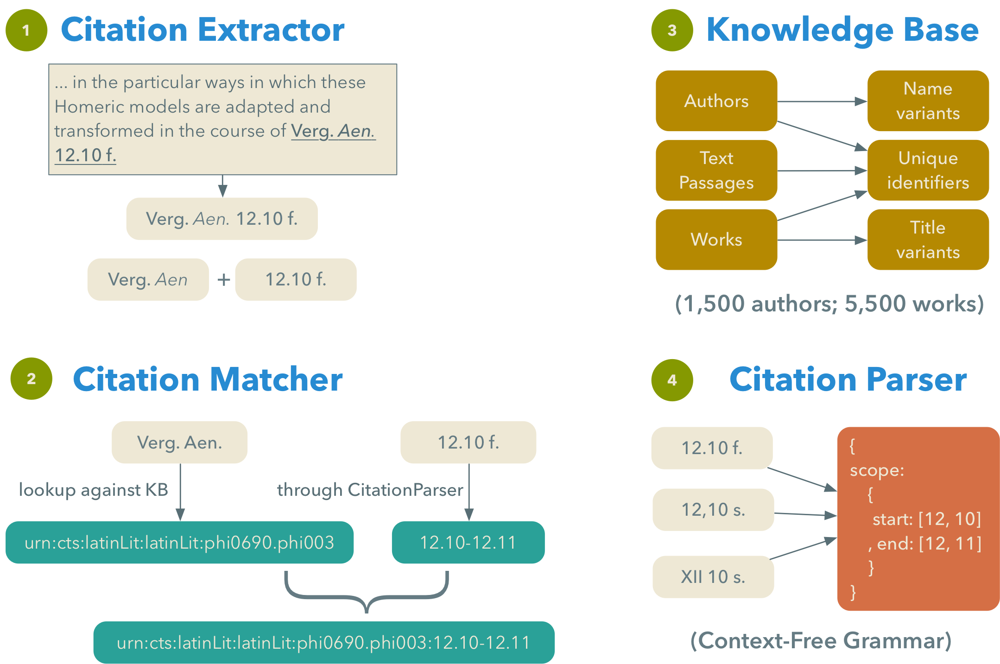

The *Cited Loci* project aims at extracting all bibliographic references pointing to classical (Greek and Latin) authors and their texts from the classics articles contained in [JSTOR](http://jstor.org).

## Technology

This project developed a citation mining solution consisting of four software components, working together to perform the extraction of references:
- the [Citation Extractor](https://github.com/mromanello/CitationExtractor), responsible for identifying the citation components within the stream of text
- the Citation Matcher, which assigns to each extracted reference a unique identifier, in the form of a CTS URN
- the [HuCit Knowledge Base](https://github.com/mromanello/hucit_kb), a database containing unique identifiers, abbreviations, and variant forms for classical authors and their works (used by Matcher and Extractor)
- the [Citation Parser](https://github.com/mromanello/CitationParser), which takes care of transforming reference scopes into a normalized form, suitable to be embedded into a CTS URN.

## Applications

### Aeneid

### EpiBau

### CHS OA Books

## Publications

- Romanello, M. 2015. “From Index Locorum to Citation Network: An Approach to the Automatic Extraction of Canonical References and Its Applications to the Study of Classical Texts.” King’s College London. [doi:11858/00-1780-0000-002A-4537-A](http://dx.doi.org/11858/00-1780-0000-002A-4537-A).
